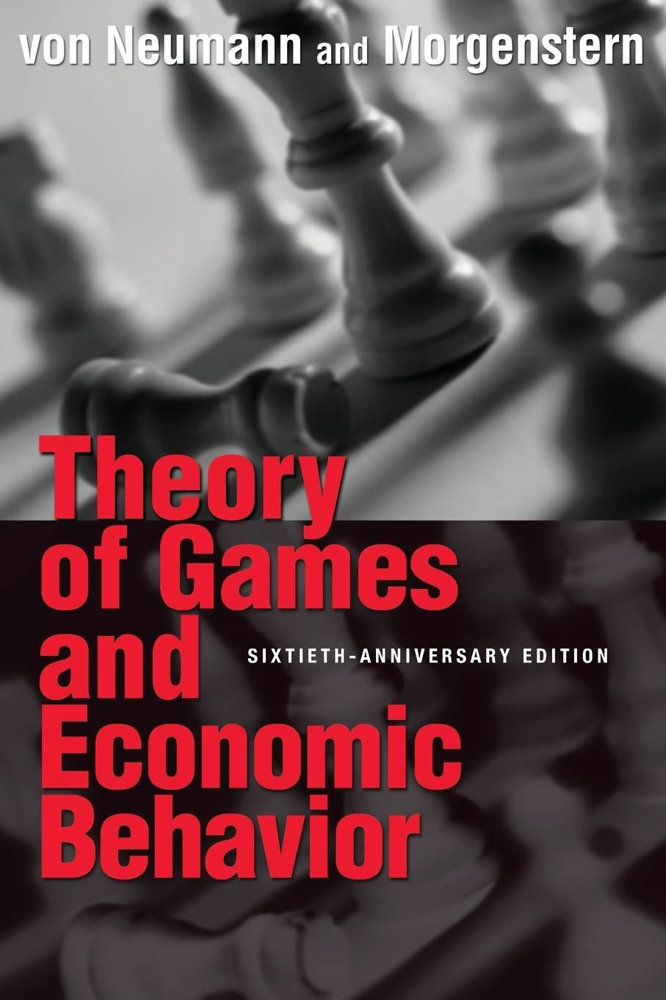
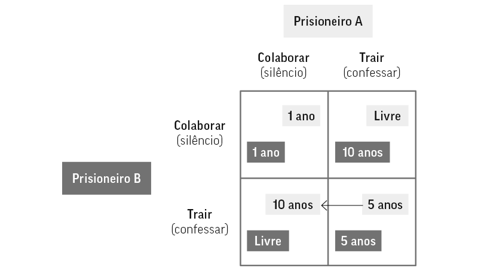
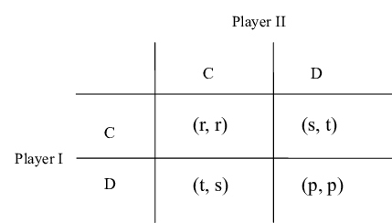

## Resumo  
Este artigo apresenta uma análise abrangente da Teoria dos Jogos como método da pesquisa operacional (OR), abordando sua origem histórica, fundamentação teórica, formulação matemática, aplicações práticas, um exemplo resolvido detalhadamente, discussão crítica e perspectivas futuras. Parte-se dos fundamentos históricos com von Neumann e Morgenstern, passando por Nash, e avança até técnicas computacionais modernas. O texto visa oferecer clareza acadêmica e rigor técnico, articulando teoria e aplicação em contextos como economia, logística e ciência da computação.

## Introdução  
A Teoria dos Jogos emerge como ramo da matemática aplicada dedicado ao estudo de situações em que múltiplos agentes (jogadores) tomam decisões estratégicas cujos desfechos são interdependentes. Seu surgimento formal se dá com John von Neumann e Oskar Morgenstern, que em 1944 publicaram *Theory of Games and Economic Behavior*, reconhecido como o texto fundador do campo. No contexto da pesquisa operacional, esse método integrou-se ao conjunto de ferramentas matemáticas da OR a partir dos anos 1950, junto com programação linear, teoria das filas e simulação. A relevância da Teoria dos Jogos na OR está em fornecer estrutura para análise de conflitos, cooperação e competição em sistemas complexos, sendo aplicada em logística, economia, ciência da computação e gestão estratégica.

<figure style="text-align: center;">
  
  <figcaption style="font-size: 0.9em; color: gray; margin-top: 0.5em;">
    Capa do livro "Theory of Games and Economic Behavior"
  </figcaption>
</figure>

## Fundamentação Teórica  
A base teórica da Teoria dos Jogos inclui conceitos como jogos de soma zero, jogos não-cooperativos, equilíbrio de Nash, teorema minimax, jogos em forma normal e estendida, entre outros. O teorema minimax, demonstrado por von Neumann em 1928, mostra que em jogos de soma zero existe uma estratégia ótima mista que minimiza perdas, mesmo diante de adversários racionais. A ampliação para equilibrar interesses mutuamente interdependentes encontra seu ponto de inflexão no conceito de **equilíbrio de Nash**, proposto por John Nash na década de 1950: um conjunto de estratégias em que nenhum jogador melhora seu resultado ao mudar de forma unilateral. A interpretação clássica da **prisão do dilema**, desenvolvida por Flood e Dresher no RAND em 1950, ilustra como a cooperação racional pode falhar em jogos não-cooperativos.

<figure style="text-align: center;">
  
  <figcaption style="font-size: 0.9em; color: gray; margin-top: 0.5em;">
    Matriz do Dilema do Prisioneiro
  </figcaption>
</figure>

### Evolução histórica  
Desde as primeiras ideias em 1713 (Waldegrave), passando pelas conclusões de Cournot em 1838, até os marcos de von Neumann (1928) e a formalização com Morgenstern (1944), a Teoria dos Jogos tornou-se gradualmente central na análise estratégica. As contribuições posteriores de Nash, Selten e Harsanyi, além da aplicação em biologia evolutiva com estratégias evolutivamente estáveis (Maynard Smith), e o reconhecimento com o Nobel de Nash, Harsanyi e Selten em 1994, marcam seu desenvolvimento contínuo.

## Formulação Matemática  
A formulação matemática envolve representar o jogo em **forma normal** (matriz de payoff) ou **forma extensiva** (árvores de decisão), definindo jogadores, estratégias, funções de utilidade e os critérios de equilíbrio. Para jogos de soma zero, utiliza-se o problema minimax:

$$
\max_{x} \min_{y} x^T A y
$$

Para jogos bimatrix não-cooperativos, o equilíbrio de Nash satisfaz:

$$
u_i(s_i^*, s_{-i}^*) \ge u_i(s_i, s_{-i}^*) \quad \forall i, \forall s_i
$$

onde $s_i^*$ é melhor resposta dos jogadores.

<figure style="text-align: center;">
  
  <figcaption style="font-size: 0.9em; color: gray; margin-top: 0.5em;">
    Matriz de payoff e suas estratégias
  </figcaption>
</figure>

## Aplicações Práticas  
As aplicações da Teoria dos Jogos dentro da OR são vastas: na gestão de cadeias de suprimentos, coordenação sob competição e cooperação (Stackelberg, Cournot), precificação e contratos, logística reversa, economia circular e compartilhada. Também se estende à análise de riscos, alocação de recursos e gestão de projetos. Em ambientes de defesa, modela cenários estratégicos de conflito, guerra e segurança. Na ciência da computação, surgem modelos sofisticados com aprendizado multiagente e análise distribuída de equilíbrios.  

<figure style="text-align: center;">
  
  <figcaption style="font-size: 0.9em; color: gray; margin-top: 0.5em;">
    Cadeia de suprimentos: competição e cooperação entre empresas
  </figcaption>
</figure>

## Exemplo Resolvido Passo a Passo  

**Problema**: Duas empresas competem em preço — alta (H) ou baixa (B). Payoffs (Empresa A, Empresa B):

| A\B | H       | B       |
|-----|---------|---------|
| H   | (2,2)   | (1,3)   |
| B   | (3,1)   | (2,2)   |

**Passo 1**: Repostas ótimas de A:
- Se B escolher H → A escolhe B (3>2).
- Se B escolher B → A escolhe H (2>1).

**Passo 2**: Respostas ótimas de B:
- Se A escolher H → B escolhe B (3>2).
- Se A escolher B → B escolhe H (2>1).

**Passo 3**: Encontre o equilíbrio (interseção de melhores respostas). O único resultado estável é (B,B), com payoff (2,2). Este é o equilíbrio de Nash.

## Discussão Crítica  
A Teoria dos Jogos oferece poder de modelagem de interações estratégicas, clareza conceitual e mecanismos formais de solução. Contudo, enfrenta limitações: múltiplos equilíbrios, suposições de racionalidade ilimitada, informação completa ou parcial idealizada, além de desafios computacionais em jogos de grande escala. Extensões como jogos evolutivos, cooperação repetida, jogos estocásticos e aprendizado multiagente visam mitigar as limitações e adaptar o método a cenários mais realistas.

## Conclusão  
A Teoria dos Jogos consolidou-se como um método essencial dentro da pesquisa operacional, unindo rigor teórico e amplitude de aplicação. Desde suas origens com von Neumann e Morgenstern até sua integração em cadeias de suprimentos, economia compartilhada, defesa e algoritmos modernos, mostra-se indispensável para análise estratégica e otimização de sistemas competitivos. Perspectivas futuras apontam para fusões com inteligência artificial, aprendizado distribuído e grande escala, ampliando o escopo e a efetividade da teoria.

---

## Referências  
- Vicente, R. *Uma Introdução à Teoria dos Jogos*. Universidade de São Paulo. Disponível em: [ime.usp.br](https://www.ime.usp.br/~rvicente/IntroTeoriaDosJogos.pdf)  
- Santos, C. S. *Introdução à Teoria dos Jogos*. Universidade Federal de Sergipe. Disponível em: [ri.ufs.br](https://ri.ufs.br/bitstream/riufs/8805/2/CLEVERTON_SOUZA_SANTOS.pdf)  
- Andrade, M. A. R. *Teoria dos Jogos, uma ferramenta para a estratégia nas organizações*. Anais do SEGeT, 2016. Disponível em: [aedb.br](https://www.aedb.br/seget/arquivos/artigos16/24124247.pdf)  
- Moreira, R. C. *Um estudo comparativo entre a Teoria dos Jogos e a Teoria dos Custos em redes*. Produção Online, 2003. Disponível em: [scielo.br](https://www.scielo.br/j/pope/a/zzm4gHDnCp5HZMGmcCkSwMx/abstract/?format=html&lang=pt)  
- Wikipedia. *Teoria dos Jogos*. Disponível em: [pt.wikipedia.org](https://pt.wikipedia.org/wiki/Teoria_dos_jogos)  
